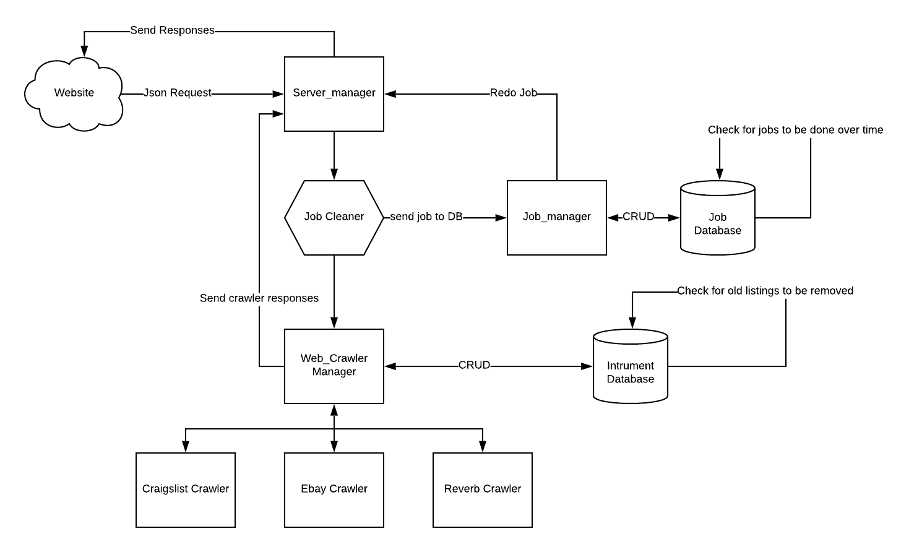

# instrument-resell-tracker

---
This program searches resell platforms periodically to assist in finding stolen instruments

## How to Run

1. Install dependencies: 
`pip install -r requirements.txt`
2. Run Mongodb Server: 
`sudo docker run -d -p 27017-27019:27017-27019 --name mongodb mongo:4.0.4`
3. Run Server_Manager.py: 
`sudo python3 Server_Manager.py`
4. Run Client.py: 
`python3 Client.py`

### Example output:

> {"item": [{'url': 'https://www.ebay.com/itm/Gibson-ES-175-1987-Natural-/173986965113', 'category': 'Electric Guitars', 'location': 'Woodside,NY,USA', 'image': 'https://thumbs2.ebaystatic.com/m/mjzz9ndAGyus9En06u3Zgqg/140.jpg', 'make': 'Gibson', 'title': 'Gibson ES-175 1987 Natural', 'year': 1987, 'endTime': 63736869600000, 'model': 'ES-175 '}]}

### How it works

